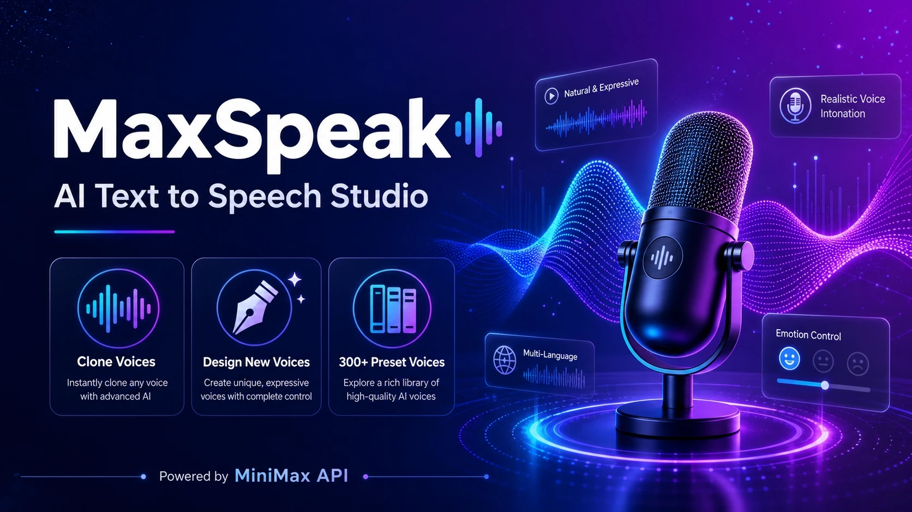

<p align="center">
  
</p>

# <picture><source media="(prefers-color-scheme: dark)" srcset="https://img.shields.io/badge/MaxSpeak-a78bfa?style=for-the-badge&logo=data:image/svg+xml;base64,PHN2ZyB4bWxucz0iaHR0cDovL3d3dy53My5vcmcvMjAwMC9zdmciIHdpZHRoPSIyNCIgaGVpZ2h0PSIyNCIgdmlld0JveD0iMCAwIDI0IDI0IiBmaWxsPSJub25lIiBzdHJva2U9IiNmZmYiIHN0cm9rZS13aWR0aD0iMiI+PHBhdGggZD0iTTIgM3YxOGgxOE0yIDlsOCA4bDQtNCIvPjxwYXRoIGQ9Ik0yMiA5djEyTTIgMTR2NyIvPjwvc3ZnPg=="></picture>

# MaxSpeak — AI Text to Speech Studio

> **Free · Open Source · 300+ Voices · Voice Cloning · Voice Design**
>
> Powered by [MiniMax](https://platform.minimax.io) — the leading speech synthesis API.

[Live Demo](#) · [Deploy to Vercel](https://vercel.com/new) · [Cloudflare Pages](#)

---

*中文文档：[README.md](./README.md)*

## Why MaxSpeak

| Feature | Description |
|---------|-------------|
| **Text to Speech** | Convert any text to natural speech with 9 emotion styles, paralinguistic tags (sighs/laughs/breaths), and fine-grained speed/pitch/timbre controls |
| **Voice Cloning** | Upload a 10-second audio sample and replicate any voice — ideal for creators, podcasts, audiobooks, and accessibility |
| **Voice Design** | Describe a voice in plain English and let AI create it — "a warm, friendly female voice for a bedtime story" |
| **Streaming & Sync** | Get instant playback via SSE streaming for long texts, or download high-quality audio files |
| **300+ System Voices** | Pre-built voices in Chinese, English, Japanese, Korean, Spanish, Portuguese, French, and 14 more languages |

## Quick Start

```bash
git clone https://github.com/your-username/maxspeak.git
cd maxspeak
npm install
npm run dev
```

Open [http://localhost:3000](http://localhost:3000), click the settings gear, paste your [MiniMax API key](https://platform.minimax.io), and start generating speech.

## Deploy

### Vercel (Recommended)
Click to deploy with zero configuration:
[](https://vercel.com/new)

### Cloudflare Pages
```bash
npm install -D @cloudflare/next-on-pages
npx @cloudflare/next-on-pages
npx wrangler pages deploy .vercel/output/static
```

> **Note:** Cloudflare Pages deploys as static output. API Routes won't work — use Vercel for full functionality.

## Tech Stack

- **Framework** — Next.js 14 (App Router) + TypeScript
- **UI** — React 18 + Tailwind CSS + lucide-react icons
- **State** — Zustand (persisted to localStorage)
- **Audio** — Web Audio API + native `<audio>` for robust cross-browser playback
- **API** — Next.js API Routes proxying MiniMax TTS, Voice Clone, and Voice Design endpoints

## Architecture — MiniMax API Proxy

```
Browser                Next.js Server              MiniMax API
  │                         │                          │
  ├─ POST /api/tts/synthesize ──►  POST /v1/t2a_v2 ──►   ┌─ audio CDN URL
  │                         │                          │──► hex audio data
  │                         │   ◄── fetch CDN binary ──┤
  │  ◄── raw audio blob ────┤                          │
  │                         │                          │
  ▼                    API Key stays server-side       ▼
 [blob URL → <audio>]                              [300+ voices]
```

- **API Key never reaches the browser** — all MiniMax requests are proxied through Next.js server routes
- **CDN audio is fetched server-side** and returned as a same-origin blob, eliminating CORS issues
- Streaming uses SSE passthrough with real-time chunk decoding

## Supported Languages & Voices

| Language | Count | Highlights |
|----------|-------|------------|
| 中文 (Chinese) | 34 | 可靠高管, 新闻主播, 暖心闺蜜, 可爱精灵 |
| English | 45 | Expressive Narrator, Radiant Girl, Magnetic Voiced Man |
| 한국어 (Korean) | 49 | 운동소녀, 차분한 신사, 용감한 모험가 |
| 日本語 (Japanese) | 15 | 知的先輩, 優しい執事, 優雅な乙女 |
| 粵語 (Cantonese) | 6 | 專業主持, 溫柔女士, 可愛女孩 |
| Español | 12+ | Presentador Profesional, Narrador, Chica Alegre |
| Português | 10+ | Apresentador Profissional, Narrador, Jovem Brasileiro |
| Others | 3–8 each | Français, Deutsch, Русский, Italiano, Nederlands, Tiếng Việt, العربية, Türkçe, Українська, ภาษาไทย, Polski, हिन्दी |

Full list in `lib/voices/preset-voices.ts`.

## Audio Features

- **Emotion Control** — happy, sad, angry, fearful, disgusted, surprised, neutral, fluent, whisper
- **Paralinguistic Tags** — `(sighs)` `(laughs)` `(breath)` `(gasps)` and 18 more *(speech-2.8 models only)*
- **Voice Modifier** — pitch, intensity, timbre, and sound effects (spacious echo, telephone, radio, megaphone)
- **Audio Format** — MP3 / WAV / FLAC / PCM · 8–44.1 kHz · 64–320 kbps · mono/stereo
- **Pronunciation Dictionary** — custom phoneme overrides for Chinese tones and English words

## Pricing

MaxSpeak is free and open source. MiniMax API charges apply per use:

| Item | Cost |
|------|------|
| Text-to-Speech | ¥2.0–3.5 / 10K chars |
| Voice Clone | ¥9.9 per voice (first-use) |
| Voice Design Preview | $30 / 1M chars |

See [MiniMax Pricing](https://platform.minimax.io/docs/guides/pricing-speech) for details.

## Project Structure

```
maxspeak/
├── app/
│   ├── layout.tsx      # Layout + SEO metadata
│   ├── page.tsx        # Main page with tab routing
│   └── api/            # 6 API route handlers
├── components/
│   ├── layout/         # Sidebar, Header, ThemeProvider
│   ├── tts/            # Text-to-Speech panel & controls
│   ├── player/         # Audio player with progress bar
│   ├── clone/          # Voice cloning wizard (upload → configure → preview)
│   ├── design/         # Voice design from text prompts
│   ├── library/        # Voice library browser
│   └── settings/       # Settings modal
└── lib/
    ├── minimax/        # API client, types, constants
    ├── audio/          # Playback engine, stream decoder, utilities
    ├── voices/         # 300+ preset voices, emotion tags, language data
    └── store/          # Zustand state stores
```

## License

MIT — build anything. [MiniMax API terms](https://platform.minimax.io) apply for API usage.
